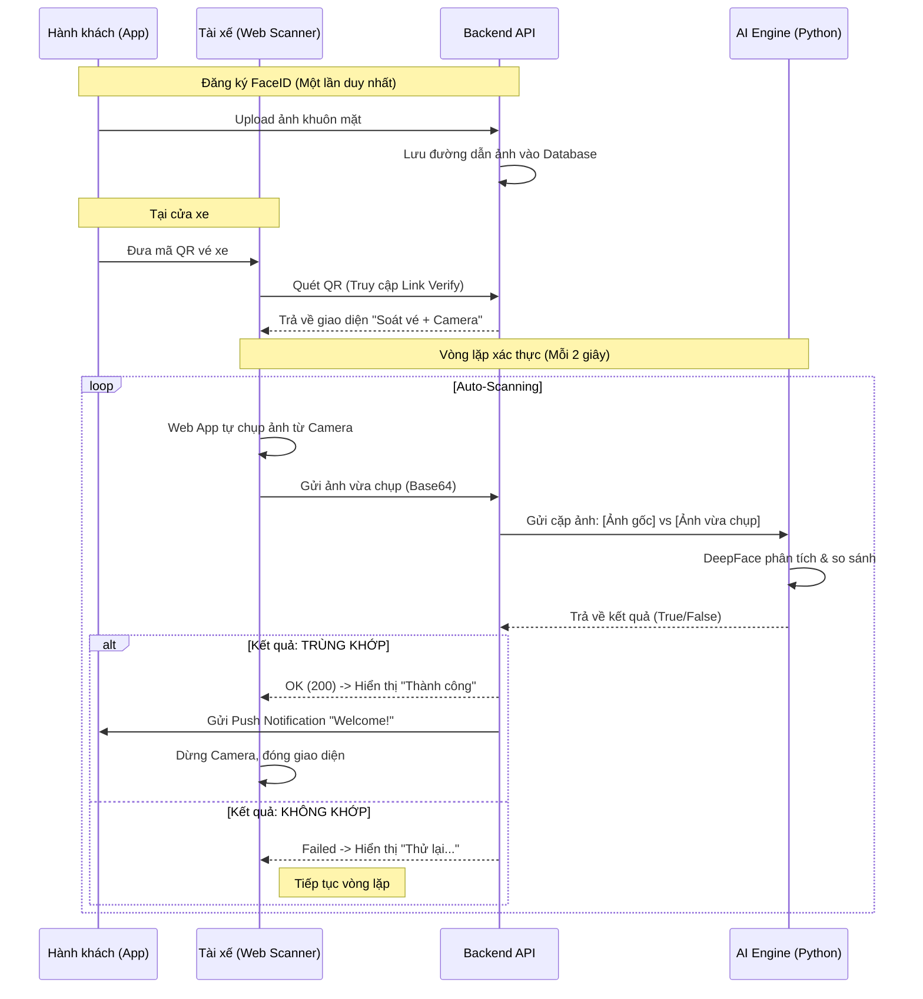

# Tài liệu Quy trình Xác thực Khuôn mặt (FaceID) Khi Lên Xe

Tài liệu này mô tả chi tiết quy trình, cách thức hoạt động và luồng xử lý của tính năng **Xác thực khuôn mặt (FaceID)** được sử dụng trong quá trình soát vé khi hành khách lên xe.

---

## 1. Giới thiệu chung

### Mục đích
Tính năng này giúp tự động hóa quy trình soát vé, tăng cường an ninh và mang lại trải nghiệm hiện đại cho hành khách. Thay vì kiểm tra vé giấy thủ công, hệ thống sử dụng **Trí tuệ nhân tạo (AI)** để so sánh khuôn mặt hành khách đang đứng trước thiết bị quét với ảnh đại diện họ đã đăng ký trên ứng dụng.

### Ưu điểm
*   **Nhanh chóng**: Tốc độ xác thực chỉ từ 1-3 giây.
*   **Chính xác**: Sử dụng mô hình AI (VGG-Face) để so sánh các đặc điểm sinh trắc học, độ chính xác cao hơn mắt thường.
*   **Linh hoạt**: Tài xế hoặc phụ xe chỉ cần một chiếc điện thoại thông minh có kết nối mạng để thực hiện việc soát vé (không cần máy chuyên dụng cồng kềnh).

---

## 2. Các bước thực hiện (Luồng người dùng)

Quy trình được chia thành 3 giai đoạn chính từ lúc người dùng ở nhà cho đến khi bước lên xe.

### Giai đoạn 1: Đăng ký FaceID (Thực hiện trên App)
Trước khi đi, hành khách cần đăng ký khuôn mặt của mình để hệ thống có dữ liệu so sánh.

1.  **Truy cập**: Người dùng vào mục **Tài khoản > Đăng ký FaceID**.
2.  **Chụp ảnh**: 
    *   Ứng dụng mở Camera trước.
    *   Người dùng đưa khuôn mặt vào khung tròn.
    *   **Công nghệ hỗ trợ**: Ngay lúc này, ứng dụng sử dụng bộ công cụ **Google ML Kit** tích hợp sẵn để phát hiện xem "có khuôn mặt thật" trong khung hình hay không. Nếu không có mặt hoặc quá tối, nút "Lưu" sẽ bị khóa.
3.  **Lưu trữ**: Ảnh hợp lệ sẽ được gửi lên máy chủ và lưu trữ an toàn trong hồ sơ người dùng.

> **Lưu ý**: Hành khách chỉ cần làm bước này **một lần duy nhất**. Các chuyến đi sau hệ thống sẽ tự động dùng lại dữ liệu này.

### Giai đoạn 2: Khởi tạo Soát vé (Tại cửa xe)
Khi xe chuẩn bị chạy, quá trình soát vé bắt đầu.

1.  **Hành khách**: Đưa vé điện tử (Mã QR) trên ứng dụng cho tài xế/phụ xe.
2.  **Tài xế/Phụ xe**: Sử dụng điện thoại (mở Camera thường hoặc App máy quét) để quét mã QR này.
3.  **Hệ thống**: 
    *   Mã QR chứa một đường dẫn bảo mật (đặc biệt chỉ dùng được 1 lần/trong thời gian ngắn).
    *   Điện thoại của tài xế sẽ tự động mở trình duyệt web và truy cập vào giao diện **"Cổng An Ninh Soát Vé"**.
    *   Tại đây, hệ thống kiểm tra ngay: **Vé này đã thanh toán chưa?**. Nếu chưa, sẽ báo lỗi ngay lập tức.

### Giai đoạn 3: Xác thực Tự động (Face Verification)
Đây là bước quan trọng nhất diễn ra trên điện thoại của Tài xế.

1.  **Giao diện**: Màn hình điện thoại tài xế chia làm 2 phần:
    *   **Bên trái**: Ảnh thẻ của khách (lấy từ dữ liệu đã đăng ký ở Giai đoạn 1). Ảnh này được làm mờ nhẹ để bảo mật quyền riêng tư.
    *   **Bên phải**: Camera đang quay trực tiếp khuôn mặt hành khách đang đứng trước mặt.
2.  **Tự động so khớp (Auto-Scan Loop)**:
    *   Hệ thống sẽ **tự động chụp hình** từ Camera mỗi 2 giây một lần.
    *   Ảnh chụp được gửi ngầm về máy chủ AI (DeepFace).
    *   AI sẽ so sánh "Ảnh vừa chụp" vs "Ảnh đăng ký".
3.  **Kết quả**:
    *   ✅ **Nếu TRÙNG KHỚP**:
        *   Màn hình hiện thông báo lớn màu xanh: **"LÊN XE THÀNH CÔNG"**.
        *   Điện thoại của hành khách (nếu đang bật mạng) cũng sẽ nhận được thông báo: *"Chúc bạn có chuyến đi vui vẻ!"*.
        *   Quy trình kết thúc.
    *   ❌ **Nếu KHÔNG KHỚP**:
        *   Hệ thống báo "Không khớp, đang thử lại...".
        *   Quá trình chụp lại tiếp tục diễn ra. Nếu do góc chụp hoặc ánh sáng, tài xế có thể yêu cầu khách đứng lại gần hơn hoặc bỏ khẩu trang/kính râm.

---

## 3. Cơ chế Kỹ thuật & Nguyên lý hoạt động (Deep Dive)

Phần này mô tả chi tiết cách hệ thống xử lý hình ảnh từ lúc nhận được cho đến khi đưa ra quyết định "trùng khớp" hay "không".

### 3.1 Quy trình xử lý ảnh (The Pipeline)
Khi server nhận được một bức ảnh từ camera tài xế, thư viện **DeepFace** sẽ thực hiện tuần tự 4 bước sau:

1.  **Phát hiện (Detection)**:
    *   Hệ thống quét toàn bộ bức ảnh để tìm vị trí khuôn mặt.
    *   Loại bỏ phần nền thừa, chỉ giữ lại khung hình chữ nhật chứa khuôn mặt.
    *   *Backend sử dụng*: RetinaFace hoặc MTCNN để đảm bảo bắt được mặt dù bị nghiêng hoặc che khuất một phần.

2.  **Căn chỉnh (Alignment)**:
    *   Khuôn mặt người thật thường không thẳng góc 100%. Hệ thống sẽ tìm vị trí 2 mắt.
    *   Sau đó xoay ảnh sao cho đường nối 2 mắt nằm ngang. Điều này cực kỳ quan trọng để tăng độ chính xác.

3.  **Biểu diễn số (Representation / Embedding)**:
    *   Đây là bước "thần thánh" nhất. Bức ảnh khuôn mặt (dữ liệu điểm ảnh) được đưa qua một Mạng nơ-ron sâu (Deep Neural Network - ví dụ VGG-Face).
    *   Đầu ra không phải là ảnh, mà là một **dãy số** (gọi là vector). Ví dụ: `[0.12, -0.45, 0.88, ... 0.04]`.
    *   Dãy số này (thường gồm 2622 con số với VGG-Face) là "mã gen" duy nhất đại diện cho khuôn mặt đó. Dù bạn cười, mếu, hay già đi, dãy số này thay đổi rất ít.

4.  **Xác thực (Verification)**:
    *   Hệ thống lấy vector của **Ảnh vừa chụp** so sánh với vector của **Ảnh đăng ký** trong database.

### 3.2 Dựa vào đâu để so sánh 2 khuôn mặt?
Máy tính không "nhìn" thấy mặt giống nhau như con người, nó so sánh hai dãy số vector ở bước trên bằng Toán học.

*   **Không gian đa chiều**: Tưởng tượng mỗi khuôn mặt là một chấm điểm trong không gian.
    *   Các ảnh khác nhau của **cùng một người** sẽ là các chấm nằm **rất sát nhau** (tạo thành 1 cụm).
    *   Ảnh của **người khác** sẽ là chấm nằm **rất xa**.

*   **Công thức khoảng cách (Distance Metric)**:
    *   Để đo độ "gần/xa", hệ thống dùng công thức **Euclidean Distance** (Đo khoảng cách đường thẳng) hoặc **Cosine Similarity** (Đo góc giữa 2 vector).
    *   Ví dụ công thức Euclidean:
        $$ d(A, B) = \sqrt{\sum_{i=1}^{n} (A_i - B_i)^2} $$

*   **Ngưỡng quyết định (Threshold)**:
    *   Hệ thống được cài đặt sẵn một con số giới hạn (ví dụ: `0.40`).
    *   Nếu khoảng cách tính được **nhỏ hơn 0.40** ➔ Kết luận: **CÙNG 1 NGƯỜI**.
    *   Nếu khoảng cách tính được **lớn hơn 0.40** ➔ Kết luận: **KHÁC NGƯỜI**.

### 3.3 Kiến trúc hệ thống thực tế
Các thành phần giao tiếp với nhau như sau:
*   **Mobile App (Flutter)**: Nơi người dùng đăng ký ảnh. Sử dụng thư viện `google_mlkit_face_detection` để validate ảnh client-side.
*   **Web Portal (HTML/JS)**: Giao diện soát vé chạy trên trình duyệt của tài xế. Sử dụng `getUserMedia API` để truy cập Camera và `fetch API` để gửi ảnh.
*   **Backend Server (NestJS)**: Trung tâm điều phối. Nhận ảnh, kiểm tra vé, gửi lệnh cho AI.
*   **AI Service (Python/DeepFace)**: Một microservice chạy riêng biệt, chuyên trách việc xử lý ảnh. Sử dụng model **VGG-Face** (một trong những model nhận diện mặt tốt nhất hiện nay).

### Sơ đồ tuân tự (Sequence Diagram)

## 4. Các câu hỏi thường gặp (FAQ)

**1. Nếu khách hàng chưa đăng ký FaceID thì sao?**
> Khi tài xế quét mã QR, hệ thống sẽ báo lỗi: *"Khách hàng chưa đăng ký FaceID"*. Lúc này tài xế sẽ kiểm tra vé thủ công bằng cách đối chiếu tên và số ghế trên màn hình.

**2. Nếu trời tối hoặc khách đeo khẩu trang?**
> AI cần nhìn rõ các đặc điểm khuôn mặt (mắt, mũi, miệng). Cần yêu cầu khách bỏ khẩu trang và đảm bảo đủ ánh sáng.

**3. Có được đeo kính khi xác thực không?**
> *   **Kính cận/loạn (trong suốt)**: Hệ thống nhận diện **bình thường**, không cần tháo kính.
> *   **Kính râm/Kính màu đậm**: Cần tháo ra vì chúng che mất mắt, khiến AI không thể so sánh chính xác.

**4. Dữ liệu ảnh có an toàn không?**
> Ảnh được lưu trữ trên máy chủ bảo mật. Khi hiển thị cho tài xế xem đối chiếu, ảnh được **làm mờ** để tránh việc chụp trộm thông tin cá nhân.

**5. Cần thiết bị máy quét chuyên dụng không?**
> Không. Bất kỳ điện thoại nào có Camera và trình duyệt Web (Chrome, Safari) đều có thể sử dụng.
